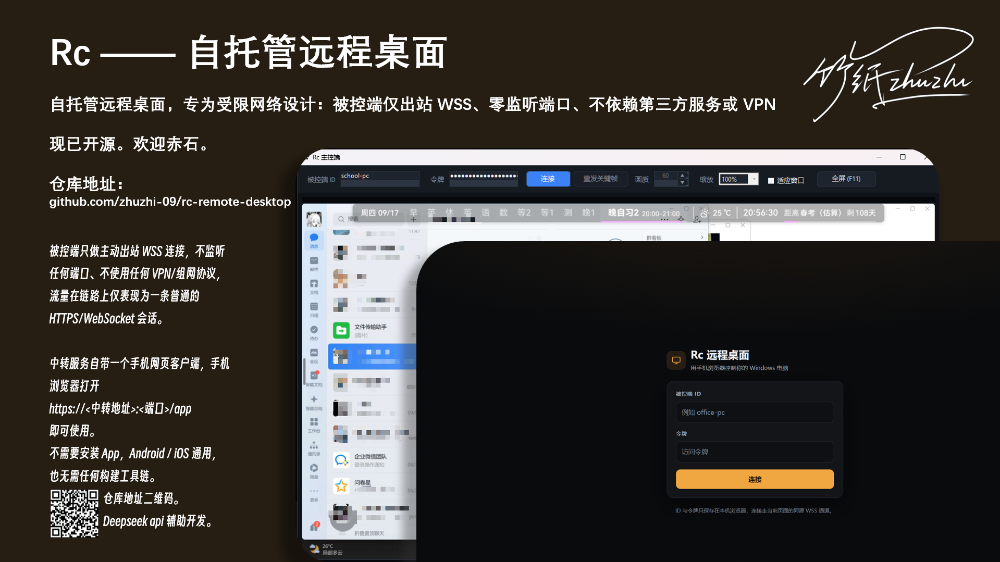

# Rc —— 自托管远程桌面

[](https://github.com/zhuzhi-09/rc-remote-desktop/actions/workflows/build.yml)



> 为受限网络设计的自托管远程桌面。被控端只做主动出站连接、零监听端口、不依赖任何第三方服务或 VPN。

被控端**只做主动出站 WSS 连接**，**不监听任何端口**、不使用任何 VPN/组网协议，
流量在链路上仅表现为一条普通的 HTTPS/WebSocket 会话。

## 架构

```
[Windows 被控端]                              [公网中转 Relay]              [Windows 主控端]
  Rc.Agent  ──出站 wss://443──►  Rc.Relay  ◄──wss──  Rc.Controller
  屏幕采集 + 分块JPEG增量编码      按 AgentId 配对转发     渲染画面 + 回收键鼠
  ◄──SendInput 键鼠注入
```

三个组件共用 `Rc.Protocol`（消息定义 + 帧编解码 + 自带证书固定的 WSS 客户端）。

## 手机客户端（零安装）

中转服务自带一个手机网页客户端，手机浏览器打开

```
https://<中转地址>:<端口>/app
```

即可使用。**不需要安装 App，Android / iOS 通用**，也无需任何构建工具链。

- 首次访问需要在浏览器里手动接受一次自签证书警告
- 填入被控端 ID 与令牌即可连接（会记在 localStorage，下次自动填好）
- 触摸操作：**点击** = 左键单击，**长按** = 右键，**单指拖动** = 平移视图，
  **双指捏合** = 缩放，**双指上下滑** = 滚轮；另有「拖拽」开关用于移动窗口 / 选中文本
- 底部工具栏提供 Esc / Tab / Enter / Backspace / Del / Ctrl+Alt+Del / Win / 方向键
- 文本输入框走系统输入法，**中文、emoji 都能用** —— 这些字符无法用 Windows 虚拟键码表示，
  协议里专门有一条 `InputKind.Text`，被控端以 `KEYEVENTF_UNICODE` 注入

## 快速开始

```powershell
.\build.ps1 -Task dist     # 发布自包含单文件产物到 publish\
.\build.ps1 -Task e2e      # 跑端到端测试（ws + wss 各一轮）
```

| 目录 | 文件 | 放到哪台机器 |
|---|---|---|
| `publish\relay-linux` | `rcrelay` | 公网 VPS / NAS |
| `publish\agent` | `rcagent.exe` | **被控端（受控主机）** |
| `publish\controller` | `rccontrol.exe` | 主控端（你自己的电脑） |

被控端和主控端都是**自包含单文件 exe，目标机器无需安装 .NET**。
部署细节（sakurafrp / VPS + Caddy / 证书固定）见 **`deploy/README.md`**。

## 目录

| 路径 | 说明 |
|---|---|
| `src/Rc.Protocol` | 共享协议：消息、帧编解码、自带证书固定与 TCP_NODELAY 的 WSS 客户端 |
| `src/Rc.Relay` | 中转服务（ASP.NET Core，可跑 Linux VPS / NAS / Docker） |
| `src/Rc.Relay/www` | 手机网页客户端（纯 HTML/CSS/JS，无框架无构建，嵌入在中转服务里） |
| `src/Rc.Agent` | 被控端（Windows 托盘程序，出站连接，零监听端口） |
| `src/Rc.Controller` | 主控端（Windows 图形界面，深色主题） |
| `tools/Rc.E2E` | 端到端自动化测试：拉起真实中转 + 真实被控端，用真实协议断言 |
| `deploy/` | 部署脚本与中文指南（Caddyfile、systemd、compose、证书/指纹脚本） |

## 验证状态

CI 在每次推送时执行：Release 构建（**警告视为错误**）+ 两种模式下的端到端测试。

`tools/Rc.E2E` 会拉起**真实的中转服务**和**真实的被控端**，用真实协议作为主控端连接并断言：

```
PASS  relay /healthz                      ok
PASS  controller handshake                Ok=True 1920x1080 tile=64 peerOnline=True
PASS  first keyframe                      510 tiles, 1920x1080, frameId=31
PASS  keyframe on demand                  frameId 31 -> 32
PASS  input path                          mouse_move injected, socket=Open, agentClean=True
PASS  frame stream alive                  59 frame message(s) in 4s
PASS  cert pinning enforced               a wrong pinned fingerprint was rejected   (仅 wss)
PASS  agent log clean                     no errors logged
PASS  controller-first: controller online with no agent   Ok=True peerOnline=False screen=0x0
PASS  controller-first: agent joins existing session      keyframe after 449ms, 510 tiles
```

最后两条是**回归测试**，专门覆盖一个曾经把画面卡死的真实缺陷：

> 主控端**先**上线、被控端**后**加入同一个会话时，`RelaySession` 里一个未完成的
> `TaskCompletionSource` 会让被控端的读循环永远不启动 —— 两端都显示"已连接"，
> 但被控端 socket 的 `Recv-Q` 会涨到数 MB 后冻结，画面全黑。

常见的连接顺序（被控端先连）恰好绕开这条路径，所以必须单独覆盖。

本地跑：

```powershell
.\build.ps1 -Task e2e     # ws 一轮 + wss 一轮
```

## 设计要点

- **网络适配**：被控端零监听端口、零 VPN 协议，只有一条出站 `wss://` 长连接。
- **低延迟**：自研 WSS 客户端在裸 TCP 上设置 `TCP_NODELAY`，避免 Nagle 带来的输入延迟。
- **抗中间人**：`pinnedCertSha256` 在自签名场景下固定服务器证书（已验证错误指纹会被拒绝）；
  用 Let's Encrypt 时改为依赖系统信任链（证书会轮换，不可固定）。
- **省带宽**：屏幕切成 64×64 块做增量比对，只对变化的块做 JPEG 编码；
  发送端单槽背压，发不过来就丢旧帧，永远发最新画面。
- **本地可控**：被控端有一个可见的状态窗口和「暂停共享」开关。暂停期间**完全不采集屏幕、
  不发送任何数据**；连接保留以便远端重新连上。托盘菜单提供同样的开关，
  配置项 `showWindow` / `startPaused` 可决定窗口是否显示、启动时是否即处于暂停。
- **弱网**：两端都带指数退避重连 + Ping/Pong 心跳超时判定。

## 已知限制

多显示器只采主屏、看不到 UAC/登录界面（需 SYSTEM 服务模式）、无剪贴板/文件传输/音频。
详见 `deploy/README.md` 第 5 节。
